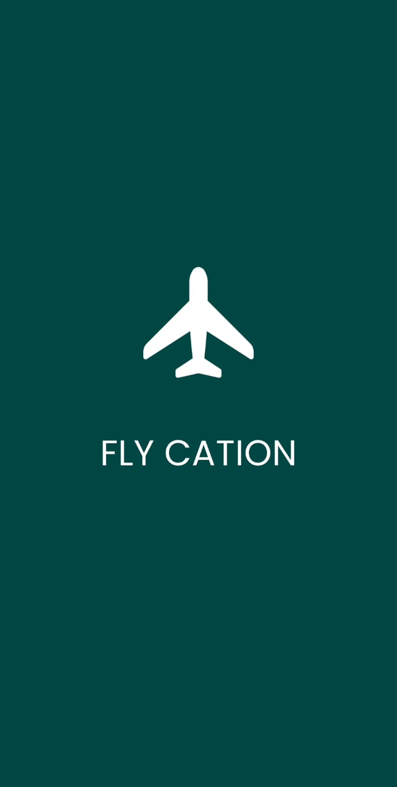
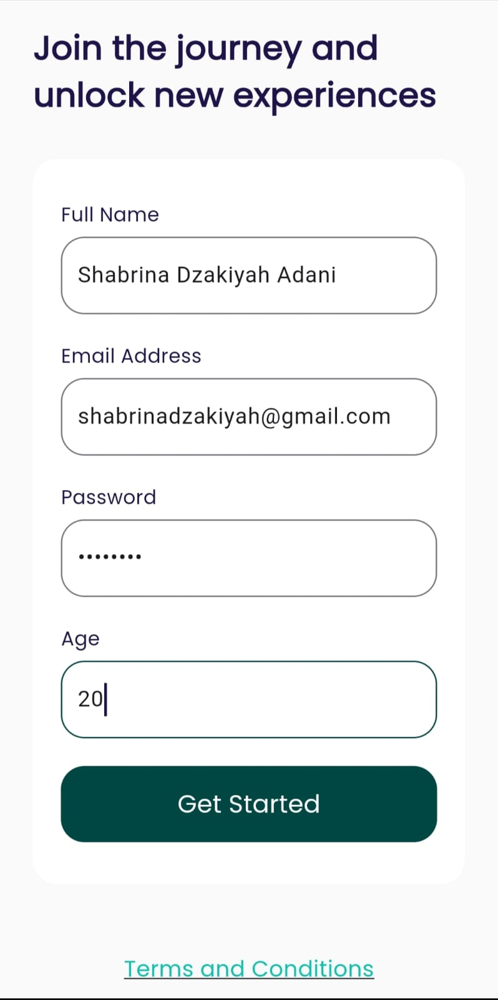
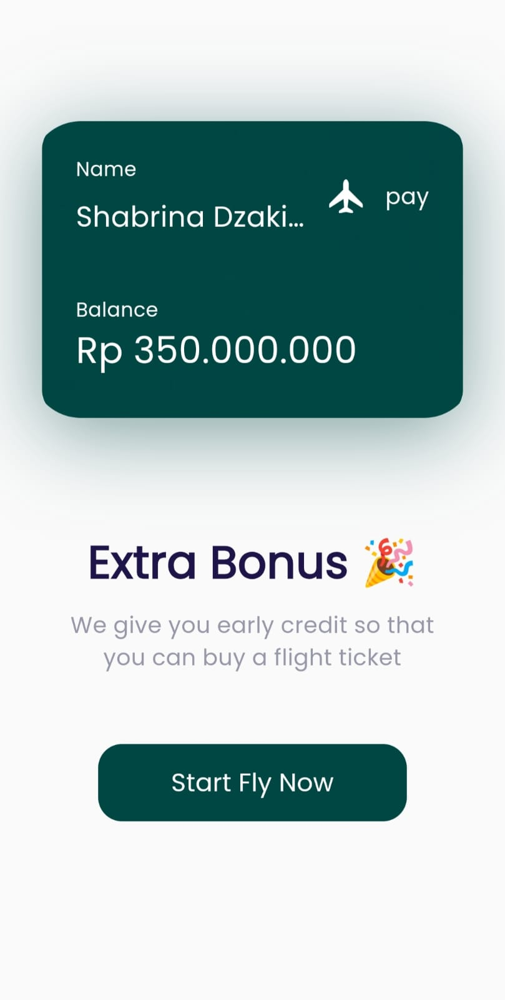
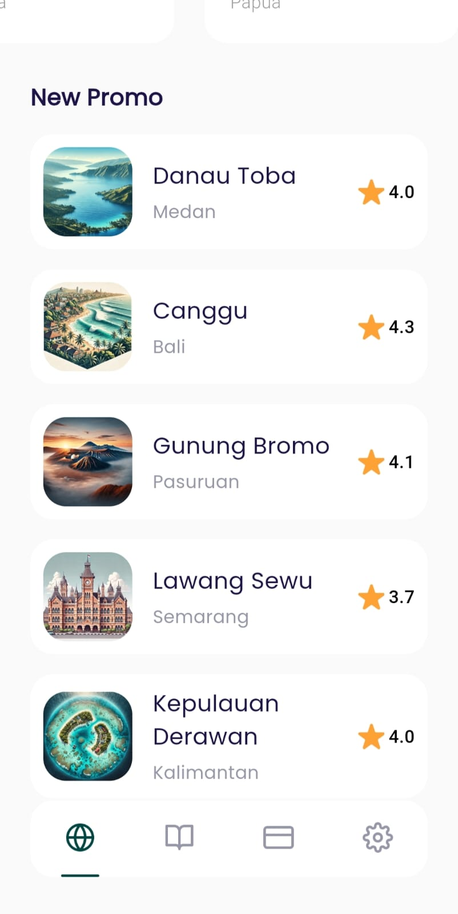
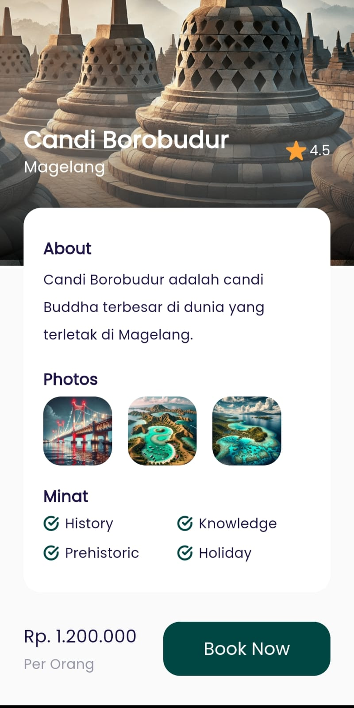
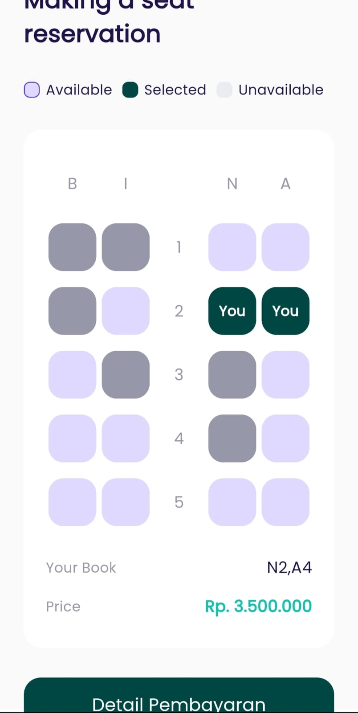
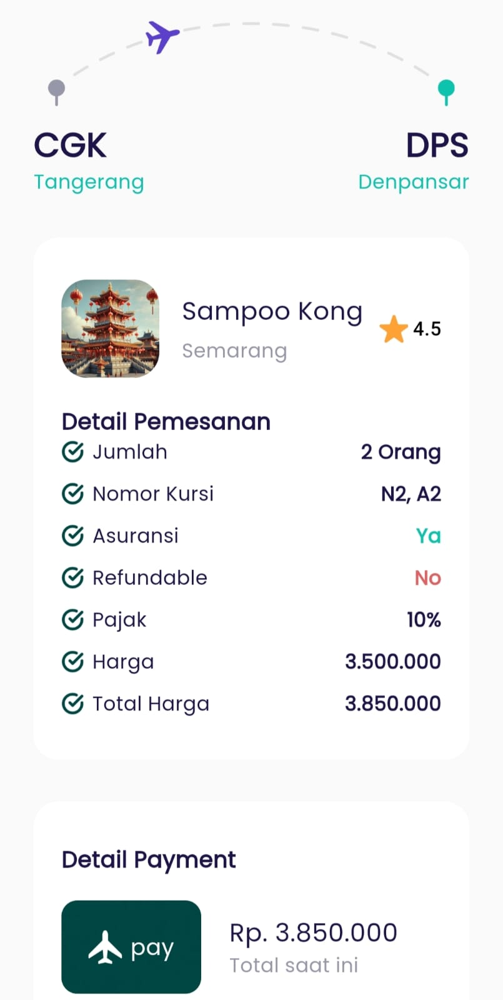
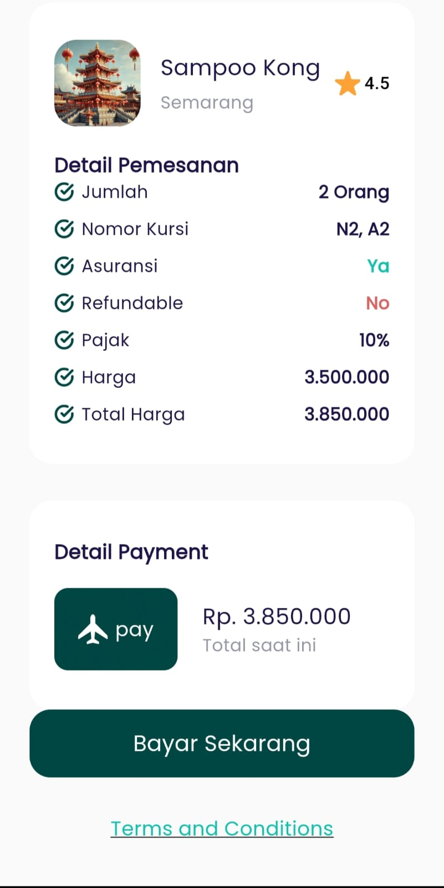

# FlyCation - Flight Booking Application

### Description
FlyCation is a mobile application for flight ticket booking that provides users with an easy way to book flights, view attractive destination promotions, and manage travel information. The app features a modern and intuitive user interface.

### Application Preview

### Installation
1. Clone this repository
2. Open the project in your preferred IDE.
3. Run the following commands:
   flutter pub get
   flutter run

